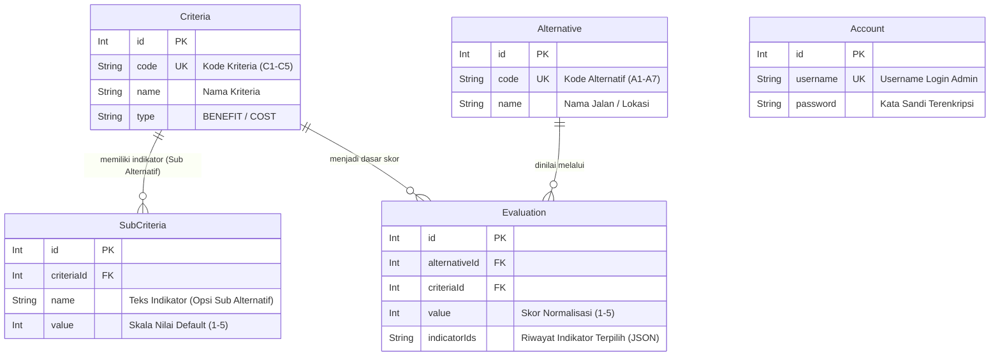
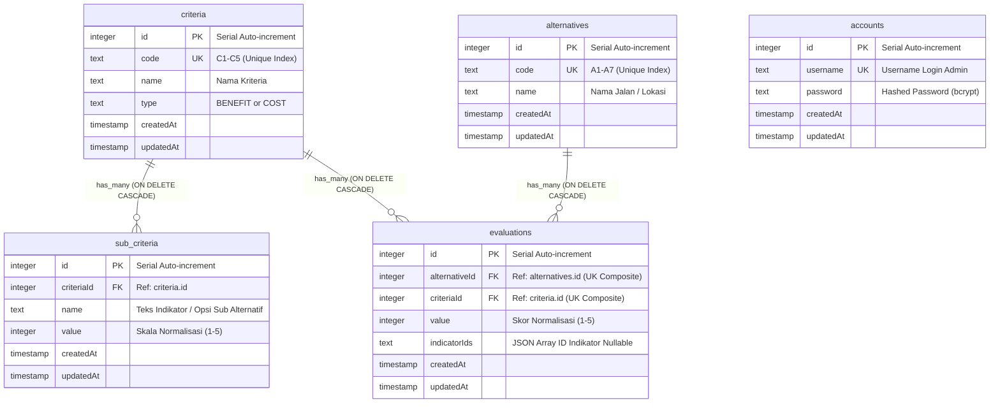

# Conceptual Data Model (CDM) & Physical Data Model (PDM)
## Sistem Pendukung Keputusan (SPK) Pemilihan Lokasi - Metode MOORA
*(Telah Diverifikasi 100% Sesuai dengan Skema Fisik PostgreSQL & Prisma Schema)*

Dokumen ini berisi rancangan basis data untuk Sistem Pendukung Keputusan (SPK) pemilihan lokasi usaha kuliner berbasis metode MOORA, yang terdiri dari **Conceptual Data Model (CDM)** dan **Physical Data Model (PDM)** menggunakan sintaks Mermaid.js.

---

## 💡 Catatan Penting Arsitektur: "Sub Alternatif" di Codebase vs Database

Saat pengembangan sistem terbaru, alur kerja diubah dari yang semula fokus pada *Sub-Kriteria* menjadi **Sub Alternatif (Pengecekan Indikator Kondisi Jalan)**. Berikut adalah hubungan antara logika aplikasi (*codebase*) dan struktur database fisik:

1. **Di Tingkat Codebase (Aplikasi & UI):**
   - Terdapat menu baru **Sub Alternatif (`/dashboard/sub-alternatif`)**.
   - Pada halaman ini, administrator memilih **Alternatif (Nama Jalan)**, lalu sistem memunculkan daftar indikator/opsi kondisi nyata di lapangan (misal: *3 syarat kenyamanan lokasi* atau *5 rentang biaya sewa*).
   - Setelah indikator dicentang dan disimpan, sistem otomatis melakukan normalisasi menjadi angka skala 1–5 yang langsung tampil pada matriks **Penilaian (`/dashboard/penilaian`)**.

2. **Di Tingkat Database Fisik (PostgreSQL & Prisma):**
   - **Tabel `sub_criteria`**: Berfungsi sebagai penyimpan daftar indikator/opsi Sub Alternatif tersebut. Karena secara struktur indikator-indikator ini memang merupakan turunan standar dari masing-masing Kriteria (`criteriaId`), tabel ini dipertahankan namanya di database demi stabilitas dan relasi yang optimal.
   - **Tabel `evaluations`**: Memiliki kolom baru yaitu **`indicatorIds` (bertipe `text`)** untuk merekam riwayat ID indikator apa saja yang dicentang oleh user untuk jalan tersebut dalam bentuk JSON Array (contoh: `"[1, 2, 3]"`), sekaligus menyimpan skor hasil normalisasinya di kolom **`value`**.

Dengan arsitektur ini, sistem menjadi sangat efisien, bersih, dan tidak memerlukan tabel redundan di database.

---

## 1. Conceptual Data Model (CDM)

**Conceptual Data Model (CDM)** merepresentasikan struktur model domain logis yang ada dalam sistem (sesuai dengan definisi model di `schema.prisma`), menunjukkan relasi dan atribut utama tanpa detail teknis tipe data spesifik mesin database fisik.

---

## 2. Physical Data Model (PDM)

**Physical Data Model (PDM)** ini direfleksikan **langsung dari katalog sistem (`information_schema.columns`) PostgreSQL fisik Anda**. Seluruh tipe data fisik (`integer`, `text`, `timestamp without time zone`), nama kolom fisik, dan aturan integritas relasional (`ON DELETE CASCADE`) telah dipastikan 100% presisi sesuai database fisik.

---

## 3. Detail Spesifikasi Fisik Tabel PostgreSQL (PDM)

### A. Tabel `criteria` (Kriteria SPK)
| Kolom | Tipe Data PostgreSQL Fisik | Keterangan | Aturan / Constraint |
| :--- | :--- | :--- | :--- |
| `id` | `integer / serial` | Identifier unik kriteria | **PK**, Auto Increment |
| `code` | `text` | Kode kriteria (C1, C2, dst.) | **UK** (Unique Index), Not Null |
| `name` | `text` | Nama kriteria (Lokasi, Biaya Sewa, dll.) | Not Null |
| `type` | `text` | Sifat atribut kriteria | `BENEFIT` atau `COST`, Not Null |
| `createdAt` | `timestamp without time zone` | Waktu pencatatan data | Default: `CURRENT_TIMESTAMP`, Not Null |
| `updatedAt` | `timestamp without time zone` | Waktu pembaharuan terakhir | Auto Updated, Not Null |

### B. Tabel `sub_criteria` (Indikator & Opsi Sub Alternatif)
| Kolom | Tipe Data PostgreSQL Fisik | Keterangan | Aturan / Constraint |
| :--- | :--- | :--- | :--- |
| `id` | `integer / serial` | Identifier unik indikator/opsi | **PK**, Auto Increment |
| `criteriaId` | `integer` | Referensi ke tabel kriteria | **FK** ➔ `criteria(id)` (`ON DELETE CASCADE`), Not Null |
| `name` | `text` | Teks indikator kondisi lokasi (opsi Sub Alternatif) | Not Null |
| `value` | `integer` | Skala normalisasi referensi | Not Null (Rentang 1–5) |
| `createdAt` | `timestamp without time zone` | Waktu pencatatan data | Default: `CURRENT_TIMESTAMP`, Not Null |
| `updatedAt` | `timestamp without time zone` | Waktu pembaharuan terakhir | Auto Updated, Not Null |
*Catatan:* Di level aplikasi, tabel ini berperan sebagai penyedia daftar opsi/indikator saat admin mengisi menu **Sub Alternatif**.

### C. Tabel `alternatives` (Alternatif / Nama Jalan)
| Kolom | Tipe Data PostgreSQL Fisik | Keterangan | Aturan / Constraint |
| :--- | :--- | :--- | :--- |
| `id` | `integer / serial` | Identifier unik alternatif | **PK**, Auto Increment |
| `code` | `text` | Kode alternatif (A1, A2, dst.) | **UK** (Unique Index), Not Null |
| `name` | `text` | Nama jalan / lokasi usaha | Not Null |
| `createdAt` | `timestamp without time zone` | Waktu pencatatan data | Default: `CURRENT_TIMESTAMP`, Not Null |
| `updatedAt` | `timestamp without time zone` | Waktu pembaharuan terakhir | Auto Updated, Not Null |

### D. Tabel `evaluations` (Penilaian & Matriks Keputusan)
| Kolom | Tipe Data PostgreSQL Fisik | Keterangan | Aturan / Constraint |
| :--- | :--- | :--- | :--- |
| `id` | `integer / serial` | Identifier unik penilaian | **PK**, Auto Increment |
| `alternativeId`| `integer` | Referensi ke tabel alternatif | **FK** ➔ `alternatives(id)` (`ON DELETE CASCADE`), Not Null |
| `criteriaId` | `integer` | Referensi ke tabel kriteria | **FK** ➔ `criteria(id)` (`ON DELETE CASCADE`), Not Null |
| `value` | `integer` | Angka hasil normalisasi untuk MOORA | Not Null (Rentang 1–5) |
| `indicatorIds` | `text` | Riwayat ID indikator yang dicentang di Sub Alternatif | Nullable, Default: `'[]'` (format JSON Array string) |
| `createdAt` | `timestamp without time zone` | Waktu pencatatan data | Default: `CURRENT_TIMESTAMP`, Not Null |
| `updatedAt` | `timestamp without time zone` | Waktu pembaharuan terakhir | Auto Updated, Not Null |
*Catatan:* Terdapat *Composite Unique Constraint* pada `(alternativeId, criteriaId)` untuk menjamin satu alternatif jalan hanya memiliki tepat satu skor per kriteria.

### E. Tabel `accounts` (Akun Administrator)
| Kolom | Tipe Data PostgreSQL Fisik | Keterangan | Aturan / Constraint |
| :--- | :--- | :--- | :--- |
| `id` | `integer / serial` | Identifier unik akun | **PK**, Auto Increment |
| `username` | `text` | Username untuk login admin | **UK** (Unique Index), Not Null |
| `password` | `text` | Kata sandi terenkripsi (bcrypt) | Not Null |
| `createdAt` | `timestamp without time zone` | Waktu pembuatan akun | Default: `CURRENT_TIMESTAMP`, Not Null |
| `updatedAt` | `timestamp without time zone` | Waktu pembaharuan terakhir | Auto Updated, Not Null |
